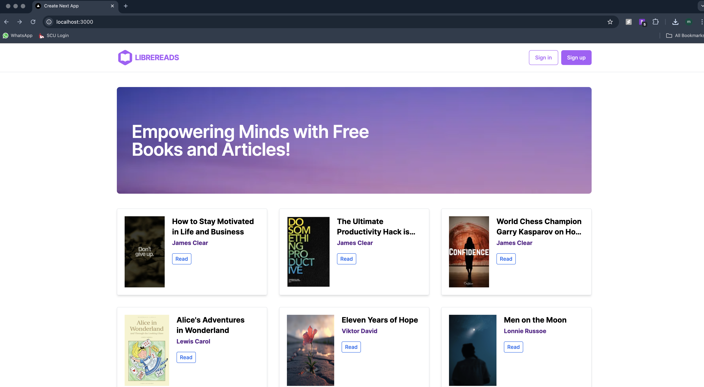

# ELibrary

A comprehensive electronic library management system for organizing, managing, and accessing digital resources.

### LibreReads Homepage


_Homepage of the LibreReads digital library platform_

## Project Components

This project consists of three main components:

1. **ELibrary API (Current Repository)**

   - Backend REST API service built with Express.js and TypeScript
   - Handles authentication, file storage, and database operations
   - Manages book data, user authentication, and file uploads
   - Repository: [LibreReads_elibrary](https://github.com/Manya7547/LibreReads_elibrary)

2. **LibreReads (Client App)**

   - Digital library platform for end users
   - Built with Next.js 14.2.3, TypeScript, and Tailwind CSS
   - Features:
     - Browse and download free books and articles
     - Book details pages with cover images
     - Server-side rendering for optimal performance
     - Responsive design with custom color scheme
     - User authentication (sign-in/sign-up)
   - Repository: [LibreReads-client-app](https://github.com/Manya7547/LibreReads-client-app)

3. **LibreReads - Elibrary Book Dashboard**
   - Administrative dashboard for managing the library system
   - Built with React, TypeScript, and Vite
   - Technical Stack:
     - shadcn/ui components with Tailwind CSS
     - Zustand for auth state management
     - React Query for server state
     - React Router for navigation
   - Features:
     - Authentication system
     - Responsive dashboard layout
     - Complete books management system
     - Protected routes
     - File upload for books and cover images
   - Repository: [LibreReads-elib-dashboard](https://github.com/Manya7547/LibreReads-elib-dashboard)

## Features

- User authentication and authorization
- Book management (CRUD operations)
- File uploads for book covers and PDF files
- Cloud storage integration with Cloudinary
- RESTful API architecture
- TypeScript implementation

## Prerequisites

- Node.js (>=16.20.1)
- MongoDB
- Cloudinary account

## Installation

1. Clone the repository:

```bash
git clone <repository-url>
cd elibrary
```

2. Install dependencies:

```bash
npm install
```

3. Create a `.env` file in the root directory with the following variables:

```
PORT=3000
MONGO_CONNECTION_STRING=your_mongodb_connection_string
NODE_ENV=development
JWT_SECRET=your_jwt_secret
CLOUDINARY_CLOUD=your_cloudinary_cloud_name
CLOUDINARY_API_KEY=your_cloudinary_api_key
CLOUDINARY_API_SECRET=your_cloudinary_api_secret
FRONTEND_DOMAIN=http://localhost:3000
```

## Running the Application

Development mode:

```bash
npm run dev
```

## API Endpoints

### Users

- POST `/api/users` - Register a new user
- POST `/api/users/login` - User login

### Books

- GET `/api/books` - List all books
- GET `/api/books/:bookId` - Get a single book
- POST `/api/books` - Create a new book (authenticated)
- PATCH `/api/books/:bookId` - Update a book (authenticated)
- DELETE `/api/books/:bookId` - Delete a book (authenticated)

## Tech Stack

- Express.js - Web framework
- TypeScript - Programming language
- MongoDB - Database
- Mongoose - ODM
- JWT - Authentication
- Multer - File upload handling
- Cloudinary - Cloud storage
- CORS - Cross-origin resource sharing

## System Architecture

The ELibrary system is composed of three interconnected applications:

1. **Backend API (This Repository)**

   - Serves as the central data management system
   - Handles all database operations and file storage
   - Provides authentication and authorization
   - Runs on port 3000 by default

2. **LibreReads Frontend**

   - Public-facing website for end users
   - Connects to the backend API for data
   - Uses Cloudinary for image optimization
   - Requires `BACKEND_URL` environment variable

3. **Admin Dashboard**
   - Administrative interface for content management
   - Connects to the backend API (default: localhost:5513)
   - Requires authentication for access
   - Manages books and system content

## License

This project is licensed under the MIT License - see the [LICENSE](LICENSE) file for details.

## Author

Manya S <manya7547@gmail.com>
